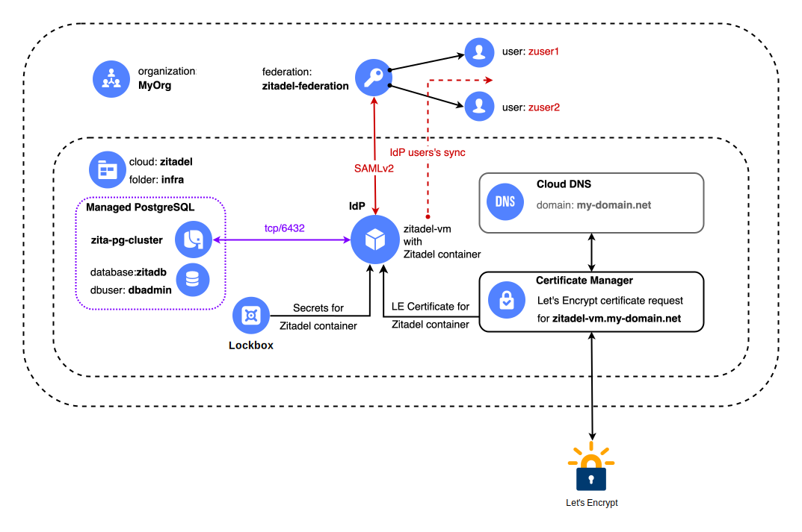
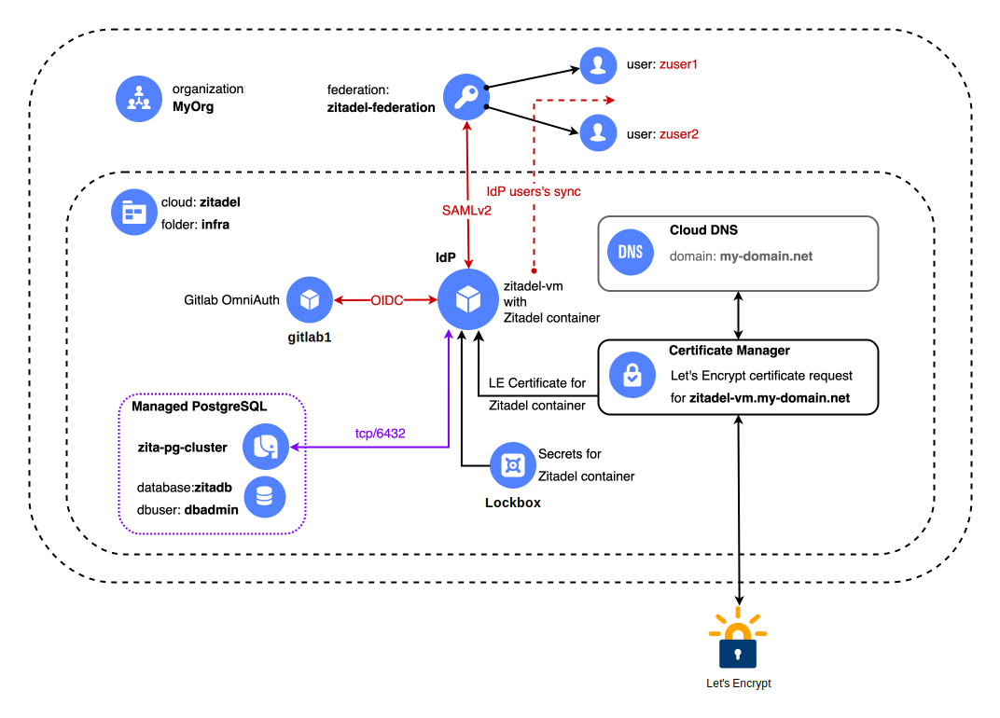
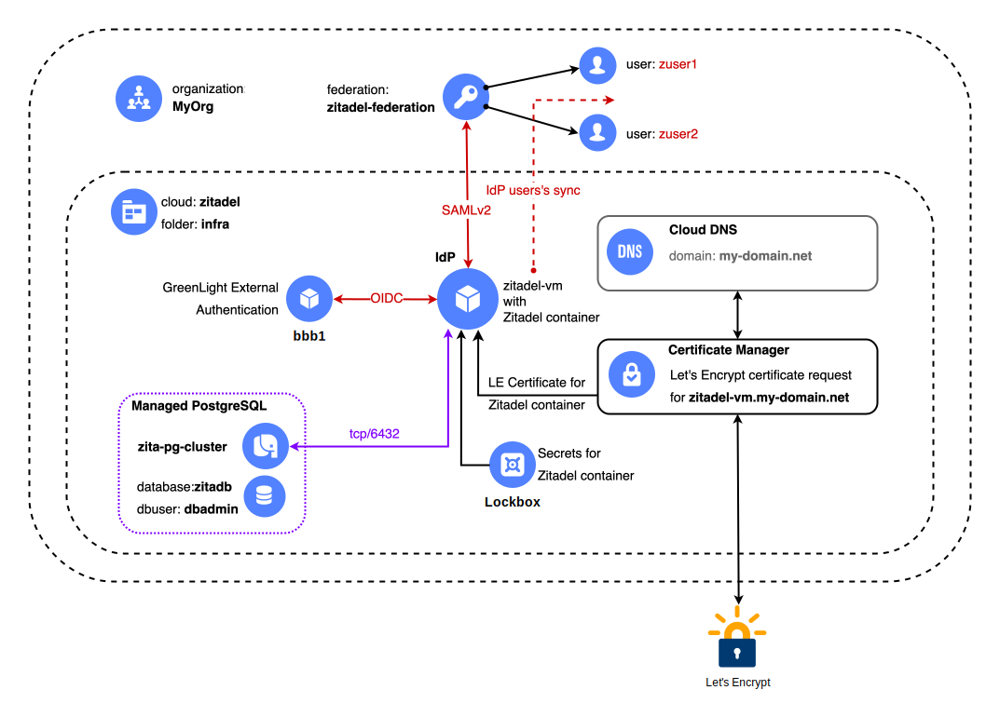
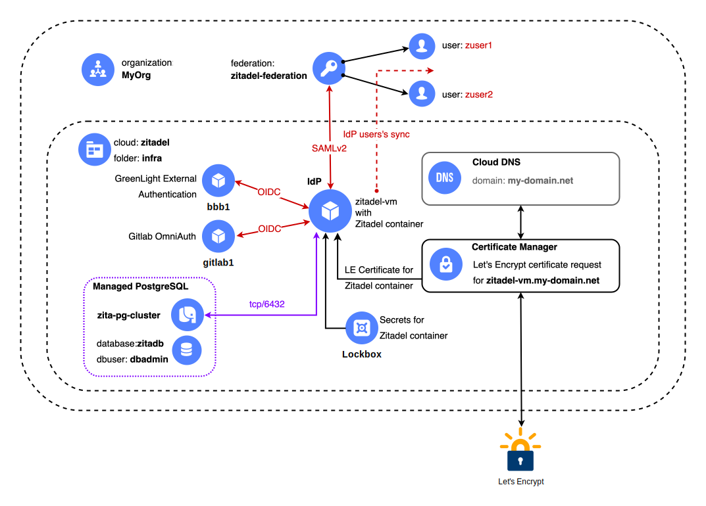

# Развёртывание федерации удостоверений в Yandex Cloud на базе решения Zitadel

## Оглавление
* [Описанние решения](#overview)
* [Аутентификация пользователя через федерацию](#flow)
* [Архитектура решения](#arch)
    * [Структура контейнера Zitadel](#container)
    * [Логическая модель Zitadel](#zita-logic)
* [Базовое развёртывание решения](#deploy-base)
    * Модуль [zitadel-deploy](./zitadel-deploy/README.md)
    * Модуль [zitadel-config](./zitadel-config/README.md) 
    * Модуль [usersgen](./usersgen/README.md)
* [Внешние зависимости](#ext-dep)
* [Порядок развёртывание решения](#deploy)
* [Результаты резвёртывания](#results)
* [Расширенные варианты развёртывания решения](#deploy-ext)
    * [Интеграция Zitadel с Yandex Managed Service for Gitlab](#deploy-gl)
    * [Интеграции Zitadel с решением Big Blue Button](#deploy-bbb)
    * [Интеграции Zitadel с Yandex Managed Service for Gitlab и решением Big Blue Button](#deploy-gl-bbb)
* [Удаление развёртывания и освобождение ресурсов](#uninstall)
* [*Хранение Terraform State в Yandex Object Storage (опционально)*](./s3-init/README.md)


## Описание решения <a id="overview"/></a>
Для предоставления доступа корпоративным пользователям к облачным ресурсам в [Yandex Cloud](https://yandex.cloud) используются:
* [Сервис организации](https://yandex.cloud/ru/docs/organization/)
* [Федерация удостоверений](https://yandex.cloud/ru/docs/organization/add-federation)
* [Identity Provider](https://en.wikipedia.org/wiki/Identity_provider) (`IdP`)

`Организация` является контейнером для пользователей. В организацию пользователи добавляются и удаляются.

`IdP` выполняет функцию аутентификации и обычно интегрируется с хранилищем учетных данных пользователей, например, MS Active Directory, база данных и т.п.

`Федерация удостоверений` выступает в роли соединителя между сервисом организации и `IdP`. С помощью федерации учетные записи пользователей из `IdP` синхронизируются в организацию Yandex Cloud.

После успешной синхронизации учетных записей пользователей в организацию Yandex Cloud, им можно [назначать роли](https://yandex.cloud/ru/docs/iam/roles-reference) (выдавать права) на облачные ресурсы. В Yandex Cloud поддерживаются федерации удостоверений на базе стандарта [SAML v2.0](https://wiki.oasis-open.org/security#SAML_V2.0_Standard). 

Ознакомиться [со списком IdP](https://yandex.cloud/ru/docs/organization/concepts/add-federation#federation-usage), которые были протестированы для работы с федерациями удостоверений в Yandex Cloud вы можете в соответствующем разделе документации. 

### Аутентификация пользователя через федерацию <a id="flow"/></a>
В данном решении `аутентификация` пользователя реализована так:
1. Пользователь вводит в браузере URL облачной консоли Yandex Cloud с указанием идентификатора федерации, например, `https://console.yandex.cloud/federations/bpf3375ucdgp5dxq823tt`.
2. Облачная консоль перенаправляет запрос пользователя на FQDN `IdP`, который развёртывается в виде виртуальной машины (ВМ) с решением [Zitadel](https://zitadel.com).
3. На странице `IdP` пользователь видит форму для аутентификации, где ему нужно ввести своё имя и пароль.
4. Пользователь вводит свои учетные данные в форму.
5. `IdP` проверяет учетные данные пользователя и в случае их успешной проверки возвращает пользователя в консоль Yandex Cloud уже аутентифицированным.
6. `Авторизация` (проверка полномочий) пользователя на облачные ресурсы будет выполняться на стороне Yandex Cloud.
7. После успешной проверки полномочий в облачной консоли пользователь должен увидеть каталоги облачных ресурсов к которым у него есть доступ.


## Архитектура решения <a id="arch"/></a>
Обобщенная архитектура базового варианта решения показана на рисунке ниже.

<p align="left">
    
</p>

Ниже дано краткое описание наиболее значимых элементов решения:

* `IdP Zitadel` - основной элемент решения. Развёртывается в виде docker-контейнера с решением [Zitadel](https://zitadel.com/docs) внутри виртуальной машины `zitadel-vm`. Контейнер собирается в процессе развёртывания решения. Структуру контейнера `Zitadel` можно посмотреть [на рисунке ниже](#container). Ознакомиться с подробностями сборки контейнера можно в его [Dockerfile](./zitadel-deploy/docker/Dockerfile).

* `Кластер БД` на базе [Yandex Managed Service for PostgreSQL](https://yandex.cloud/ru/docs/managed-postgresql/). Вспомогательный элемент, который требуется для создания базы данных для решения `Zitadel`. В данном решении кластер PostgreSQL развертывается в составе одного узла. Это неотказоустойчивая конфигурация, рекомендуемая только для тестирования. В продуктивной среде рекомендуется создавать кластер как минимум из 2х узлов. При необходимости количество узлов в кластере PostgreSQL [может быть увеличено](https://yandex.cloud/ru/docs/managed-postgresql/operations/hosts#add) до нужного количества.

* [Сloud](https://yandex.cloud/ru/docs/resource-manager/concepts/resources-hierarchy#cloud) и [Folder](https://yandex.cloud/ru/docs/resource-manager/concepts/resources-hierarchy#folder). Развертывание решения происходит в заданных при развертывании облаке и каталоге облачных ресурсов.

* `Доменная зона DNS` и сервис [Cloud DNS](https://yandex.cloud/ru/docs/dns/). Доменная зона DNS должна быть создана в каталоге облачных ресурсов до начала развертывания решения. Имя зоны DNS необходимо будет обязательно указать в параметрах развертывания. Доменная зона будет использоваться: 
    * для создания A-записи при [резервировании публичного IP-адреса](https://yandex.cloud/ru/docs/vpc/operations/get-static-ip) для ВМ `zitadel-vm`.
    * для создания проверочной записи в процессе [проверки прав на домен](https://yandex.cloud/ru/docs/certificate-manager/concepts/challenges) при создании запроса в [Certificate Manager](https://yandex.cloud/ru/docs/certificate-manager/concepts/) на получение сертификата от сервиса `Let's Encrypt (LE)`.

* Сервис [Certificate Manager](https://yandex.cloud/ru/docs/certificate-manager/)(CM) будет использоваться для получения сертификата от сервиса `Let's Encrypt` и взаимодействия в процессе получения сертификата с сервисом Cloud DNS. Контейнер `IdP Zitadel` будет обращаться при старте к CM для получения актуальной версии LE-сертификата.

### Структура контейнера Zitadel <a id="container"/></a>

Docker-контейнер с `Zitadel` собирается в процессе развёртывани виртуальной машины. 

Структура контейнера (состав компонентов) показана на схеме ниже.

<p align="left">
    
</p>


### Логическая модель Zitadel <a id="zita-logic"/></a>

Логическая структура объектов в данном развертывании и их связи между собой показаны на схеме ниже.

<p align="left">
    
</p>

Основные объекты Zitadel, показанные на схеме:


* [Instance](https://zitadel.com/docs/concepts/structure/instance) - высший уровень иерархии в архитектуре Zitadel. На этом уровне находятся параметры конфигурации по умолчанию и различные политики. В одном `Instance` можно создать одну или несколько `организаций`.

    В данном развёртывании используется Instance `ZITADEL`, который обрабатывает запросы на подключения по URL: `https://zitadel-vm.my-domain.net:8443`.


* [Organization](https://zitadel.com/docs/concepts/structure/organizations) - это контейнер для `пользователей` и `проектов`, а также связей между ними. Отдельные параметры конфигурации и политики Instance могут быть переопределены на уровне организации.

    В данном развёртывании внутри `Zitadel Instance` создаются две организации:
    * `SysOrg` - системная организация *(не показана на схеме)*, которая создаётся на этапе `(zitadel-deploy)`. В этой организации создаётся [сервисная учётная запись](https://zitadel.com/docs/concepts/structure/users#service-users) с `JWT-ключом` для аутентификации в Zitadel API с максимально широкими полномочиями. Ключ сервисной учётной записи будет использоваться далее для создания всех прочих объектов внутри Zitadel, в том числе, и при работе через Terraform провайдер. Имя файла с ключом сервисной учетной записи формирутеся в виде `<имя-ВМ>-sa.json`, в данном случае это будет `~/.ssh/zitadel-vm-sa.json`.
    
    * `MyOrg` - пользовательская организация, которая создаётся на этапе `zitadel-config`. В этой организации будут созданы все дочерние объекты, которые показаны на схеме выше. При создании этой организации ей ставится статус `Default` для упрощения операций с ней в дальнейшем. Только одна организация в составе Instance может иметь такой статус.


* [Manager](https://zitadel.com/docs/concepts/structure/users) - специальный пользователь в организации с [особыми полномочиями](https://zitadel.com/docs/guides/manage/console/managers#roles) (ролями), которые позволяют ему управлять другими пользователями в организации. Этот пользователь не будет имеет прав доступа к ресурсам Yandex Cloud. Вид полномочий (список ролей) можно задать в параметрах развёртывания.

    В данном развёртывании будет создан пользователь `userman` с полномочиями `ORG_USER_MANAGER`. Этот пользователь сможет создавать учетные записи обычных пользователей (User), а также предоставлять им возможность аутентификации в Yandex Cloud. [Подробнее о полномочиях]((https://zitadel.com/docs/guides/manage/console/managers#roles)).


* [Users](https://zitadel.com/docs/concepts/structure/users#human-users) - обычные пользователи, которым предоставляется доступ в Yandex Cloud.

    В данном развёртывании будут созданы обычные пользователи `zuser1` и `zuser2` с учётными записями которых можно аутентифицироваться в федерации удостверений Yandex Cloud.


* [Project](https://zitadel.com/docs/concepts/structure/projects) - это контейнер для `ролей пользователей` и `приложений`. В одной организации может быть несколько проектов.

    В данном развёртывании создаётся проект `yc-users`.

* [Application](https://zitadel.com/docs/concepts/structure/applications) - приложение является точкой входа пользователя в проект. Через приложения реализуются интерфейсы взаимодействия с внешними системами в рамках процессов аутентификации, авторизации и т.п.

    В данном развертывании создаётся приложение `yc-federation-saml` (тип **SAML**), которое реализует интеграцию Zitadel с федерацией удостоверений в Yandex Cloud с помощью протокола `SAMLv2`.


* [Authorizations](https://zitadel.com/docs/guides/manage/console/roles#authorizations) - механизм для добавления пользователей в проект (в Zitadel нет обычных групп пользователей). В Terraform провайдере сущность `Authorization` называется `User Grant`.


Процесс работы с пользователями в Ziadel для предоставления им доступа в Yandex Cloud сводится к двум простым шагам:
1. Создать пользователя типа `Human User`.
2. Авторизовать (создать `User Grant`) для этого пользователя в нужном проекте.

После этого пользователь сможет аутентифицироваться в Yandex Cloud. Состав облачных ресурсов и права доступа к ним будут зависеть от [набора ролей](https://yandex.cloud/ru/docs/iam/roles-reference), которые [должны быть выданы](https://yandex.cloud/ru/docs/iam/operations/roles/grant) администратором его учетной записи в облачной организации.


## Базовое развёртывание решения <a id="deploy-base"/></a>

Данное решение реализовано в виде набора `Terraform` модулей для упрощения процедуры развёртывания и его дальнейшей эксплуатации:

* Модуль [zitadel-deploy](./zitadel-deploy/README.md)
* Модуль [zitadel-config](./zitadel-config/README.md) 
* Модуль [usersgen](./usersgen/README.md)

### Внешние зависимости  <a id="ext-dep"/></a>
Решение должно развёртываться в подготовленной инфраструктуре Yandex Cloud.
Значения параметров инфраструктуры должны передаваться в `TF модули` решения в виде входных переменных. 

Перед развёртывание решения в Yandex Cloud уже должны существовать следующие объекты:
* Облако в котором будет выполняться развёртывание (`yc_infra.cloud_id`).
* Каталог облачных ресурсов в котором будет выполняться развёртывание (`yc_infra.folder_name`).
* [Публичная зона](https://yandex.cloud/ru/docs/dns/concepts/dns-zone#public-zones) в сервисе `Cloud DNS`. Домен (`yc_infra.dns_zone_name`), который будет создаваться в сервисе Cloud DNS, должен быть предварительно `делегирован` со стороны регистратора домена.
* Сеть (network) в которой будет выполняться развёртывание (`yc_infra.network`).
* Подсеть (subnet) в которой будет выполняться развёртывание (`yc_infra.subnet1`).

В списке выше в скобках указаны имена входных переменных для развёртывания из [zitadel-deploy](./zitadel-deploy/README.md#zd-inputs).


## Порядок развёртывания решения <a id="deploy"/></a>
Развёртывание решения предполагается под управлением ОС `Linux` или `MacOS`.

Развёртывание решения под управлением ОС `Windows` и [Windows Subsystem for Linux (WSL)](https://learn.microsoft.com/en-us/windows/wsl) не тестировалось.

1. Перед началом развертывания необходимо убедиться, что все необходимые инструменты установлены и настроены:
* `yc CLI` - [установлен](https://yandex.cloud/ru/docs/cli/operations/install-cli) и [настроен](https://yandex.cloud/ru/docs/cli/operations/profile/profile-create#create)
* `Terraform` - [установлен](https://yandex.cloud/ru/docs/tutorials/infrastructure-management/terraform-quickstart#install-terraform) и [настроен](https://yandex.cloud/ru/docs/tutorials/infrastructure-management/terraform-quickstart#configure-provider)
* `Python3`, а также модули [requests](https://pypi.org/project/requests) и [jwt](https://pypi.org/project/jwt) установлены.

2. Загрузить решение из репозитория на [github.com](https://github.com/yandex-cloud-examples/yc-iam-federation-with-zitadel):
    ```bash
    git clone https://github.com/yandex-cloud-examples/yc-iam-federation-with-zitadel.git
    ```

3. Выбрать нужный вариант развертывания (deploy) из следующих:
* [zitadel-deploy](./examples/zitadel-deploy/) - базовое развёртывание Zitadel.
* [zitadel-gitlab-deploy](./examples/zitadel-gitlab-deploy/) - расширенный вариант разввертывания Zitadel. Интеграция с [Yandex Managed Service for Gitlab](https://yandex.cloud/ru/docs/managed-gitlab/) (Gitlab).
* [zitadel-bbb-deploy](./examples/zitadel-bbb-deploy/) - расширенный вариант разввертывания Zitadel. Интеграция с ПО [Big Blue Button](https://docs.bigbluebutton.org/) (BBB).
* [zitadel-bbb-gitlab-deploy](./examples/zitadel-bbb-gitlab-deploy/) - расширенный вариант разввертывания Zitadel. Комбинированная интеграция с `Gitlab` и `BBB`. 

    Подробнее о расширенных вариантах развёртывания можно узнать [в отдельном разделе](#deploy-ext) этого документа.

4.  Перейти в папку с примером выбранного варианта развёртывания, например, [zitadel-deploy](./examples/zitadel-deploy/):
    ```bash
    cd yc-iam-federation-with-zitadel/examples/zitadel-deploy
    ```

5. `Важно!` Убедиться, что все [внешние зависимости](#ext-dep) уже созданы!

6. Проверить значения переменных в файле [main.tf](./examples/zitadel-deploy/main.tf) и скорректировать их. 

7. Подготовить среду для развёртывания:
    ```bash
    terraform init
    source env-setup.sh
    ```

8. Выполнить развёртывание `zitadel-deploy`:
    ```bash
    terraform apply
    ```
    Обработка запроса на выдачу сертификата в сервисе [Let's Encrypt](https://letsencrypt.org/) может выполняться `до 30 минут`!

9. Проверить состояние выданного сертификата Let's Encrypt:
    ```bash
    yc cm certificate list
    ```

10. Перейти в папку с примером развёртывания модуля [zitadel-config](./examples/zitadel-config/):
    ```bash
    cd ../zitadel-config
    ```

11. Проверить значения переменных в файле [main.tf](./examples/zitadel-config/main.tf) и скорректировать их.
   
   `Важно!` Убедиться, что в переменной `template_file` выбран [шаблон](./usersgen/README.md#user-template), соответствующий выбранному варианту развёртывания решения!


12. Скорректировать информацию о пользователях в файле [users.yml](./examples/zitadel-config/users.yml)


13. Подготовить среду для развёртывания:
    ```bash
    terraform init
    source env-setup.sh
    ```

14. Выполнить развёртывание `zitadel-config` и генерацию файла с пользовательcкими ресурсами - `users.tf`:
    ```bash
    terraform apply
    ```

15. Выполнить развёртывание пользовательских ресурсов из файла `users.tf`:
    ```bash
    terraform apply
    ```


## Результаты развёртывания <a id="results"/></a>

В результате базового развёртывания решения в Yandex Cloud будут созданы следующие объекты:
* [Федерация удостоверений](https://yandex.cloud/ru/docs/organization/concepts/add-federation) в указанной `организации`
* `Сертификат` [Let's Encrypt](https://letsencrypt.org/) для `IdP Zitadel` в сервисе [Certificate Manager](https://yandex.cloud/ru/docs/certificate-manager)
* `IdP Zitadel` успешно взаимодействует с федерацией удостоверений со стороны Yandex Cloud
* `Запись в Yandex Cloud DNS` с публичным IP-адресом ВМ `zitadel-vm`
* `Учётные записи` пользователей в IdP Zitadel синхронизированы через федерацию в организацию Yandex Cloud

После базового развёртывания решения останется выдать необходимые [роли](https://yandex.cloud/ru/docs/iam/roles-reference) на нужные облачные ресурсы для созданных в организации учётных записей пользователей.

В результате расширенных вариантов развёртывания будут созданы дополнительные объекты, соответствующие выбранному варианту.

## Расширенные варианты развёртывания решения <a id="deploy-ext"/></a>

Решение может быть развёрнуто не только в базовом варианте, но и в расширенных вариантах с интеграцией дополнительных компонентов, таких как:
* Система управления разработкой [Yandex Managed Service for GitLab](https://yandex.cloud/ru/docs/managed-gitlab/) (Gitlab)
* Система видеоконференций [Big Blue Button](https://docs.bigbluebutton.org/) (BBB)
* Интеграция с компонентами Gitlab и BBB одновременно

Расширенные варианты развёртывания отличаются от базового только в части `zitadel-deploy`, остальные части развертывания - `zitadel-config` и `usersgen` работают для всех вариантов развёртывания одинаково.

### Интеграция Zitadel с Yandex Managed Service for Gitlab <a id="deploy-gl"/></a>
<p align="left">
    
</p>

Пример развёртывания представлен в каталоге [zitadel-gitlab-deploy](./examples/zitadel-gitlab-deploy/).


### Интеграция Zitadel с решением Big Blue Button <a id="deploy-bbb"/></a>
<p align="left">
    
</p>

Пример развёртывания представлен в каталоге [zitadel-bbb-deploy](./examples/zitadel-bbb-deploy/).


### Интеграции Zitadel с Yandex Managed Service for Gitlab и решением Big Blue Button<a id="deploy-gl-bbb"/></a>
<p align="left">
    
</p>

Пример развёртывания представлен в каталоге [zitadel-bbb-gitlab-deploy](./examples/zitadel-bbb-gitlab-deploy/).


## Удаление развёртывания и освобождение ресурсов <a id="uninstall"/></a>

Освобождение ресурсов должно выполняться в порядке обратном их созданию.

1. Перейти в папку с примером развёртывания модуля [zitadel-config](./examples/zitadel-config/):
    ```bash
    cd yc-iam-federation-with-zitadel/examples/zitadel-config
    ```

2. Подготовить окружение:
    ```bash
    source env-setup.sh
    ```

3. Удалить ресурсы:
    ```bash
    terraform destroy
    ```
    Не обращать внимания на ошибку `Default Organisation must not be deleted`.

4. Перейти в папку с примером развёртывания модуля [zitadel-deploy](./examples/zitadel-deploy/):
    ```bash
    cd ../zitadel-deploy
    ```

5. Подготовить окружение:
    ```bash
    source env-setup.sh
    ```

6. Удалить ресурсы:
    ```bash
    terraform destroy
    ```

7. Удалить каталог с проектом (при необходимости)

    Выйти на уровень выше из проектного каталога и выполнить команду:
   ```bash
   rm -rf yc-iam-federation-with-zitadel
   ```
